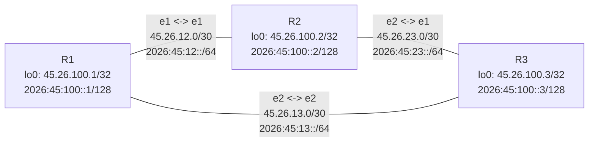

# Desafio 3: Full Mesh com RIP

Este laboratório mostra uma topologia full mesh com 3 roteadores usando RIP para IPv4 e IPv6. A ideia é observar a diferença entre redes diretamente conectadas e redes aprendidas dinamicamente.

## Objetivos

- Montar uma topologia full mesh com R1, R2 e R3.
- Configurar endereços IPv4 e IPv6 nos enlaces.
- Criar uma loopback em cada roteador para representar uma rede própria.
- Ativar RIP4 e RIP6 nas interfaces.
- Validar as rotas aprendidas com `show route`, `ping` e `traceroute`.

## Topologia



## Plano de Endereçamento

| Enlace | Roteador | Interface | IPv4 | IPv6 |
| --- | --- | --- | --- | --- |
| R1-R2 | R1 | ethernet1 | `45.26.12.1/30` | `2026:45:12::1/64` |
| R1-R2 | R2 | ethernet1 | `45.26.12.2/30` | `2026:45:12::2/64` |
| R2-R3 | R2 | ethernet2 | `45.26.23.1/30` | `2026:45:23::1/64` |
| R2-R3 | R3 | ethernet1 | `45.26.23.2/30` | `2026:45:23::2/64` |
| R1-R3 | R1 | ethernet2 | `45.26.13.1/30` | `2026:45:13::1/64` |
| R1-R3 | R3 | ethernet2 | `45.26.13.2/30` | `2026:45:13::2/64` |

| Roteador | Loopback IPv4 | Loopback IPv6 |
| --- | --- | --- |
| R1 | `45.26.100.1/32` | `2026:45:100::1/128` |
| R2 | `45.26.100.2/32` | `2026:45:100::2/128` |
| R3 | `45.26.100.3/32` | `2026:45:100::3/128` |

## Como Executar

Na raiz do repositório, confirme que o `rtr.jar` existe:

```bash
ls rtr/rtr.jar
```

Entre no diretório do laboratório e inicie a topologia:

```bash
cd basic/3
./script.sh
```

Para sair do `tmux` sem parar os roteadores, use `Ctrl+b` e depois `d`.

Para voltar:

```bash
tmux attach -t rip-fullmesh
```

Para parar:

```bash
./stop.sh
```

## Acesso por Telnet

Em outro terminal:

```bash
telnet localhost 3123
telnet localhost 3223
telnet localhost 3423
```

## O Que Observar

Comece pelas interfaces:

```text
router#show interfaces
router#show ipv4 route v1
router#show ipv6 route v1
```

Em cada roteador, separe mentalmente:

- Rotas conectadas: redes das interfaces locais.
- Rotas aprendidas: redes recebidas dos vizinhos via RIP.
- Loopbacks: bons alvos para testar roteamento fim a fim.

## Testes Sugeridos

Do R1 para as loopbacks remotas:

```text
r1#ping 45.26.100.2 vrf v1
r1#ping 45.26.100.3 vrf v1
r1#ping 2026:45:100::2 vrf v1
r1#ping 2026:45:100::3 vrf v1
```

Do R2:

```text
r2#ping 45.26.100.1 vrf v1
r2#ping 45.26.100.3 vrf v1
r2#ping 2026:45:100::1 vrf v1
r2#ping 2026:45:100::3 vrf v1
```

Do R3:

```text
r3#ping 45.26.100.1 vrf v1
r3#ping 45.26.100.2 vrf v1
r3#ping 2026:45:100::1 vrf v1
r3#ping 2026:45:100::2 vrf v1
```

Use traceroute para ver o caminho escolhido:

```text
r1#traceroute 45.26.100.2 vrf v1
r1#traceroute 45.26.100.3 vrf v1
r2#traceroute 45.26.100.1 vrf v1
```

## Experimentos de Aprendizado

1. Veja as rotas antes de testar ping:

```text
r1#show ipv4 route v1
r1#show ipv6 route v1
```

2. Desative um enlace e observe a convergência:

```text
r1#conf t
r1(cfg)#interface ethernet2
r1(cfg-if)#shutdown
r1(cfg-if)#end
```

Depois, confira se o tráfego ainda chega ao R3 passando por R2:

```text
r1#ping 45.26.100.3 vrf v1
r1#traceroute 45.26.100.3 vrf v1
```

3. Reative o enlace:

```text
r1#conf t
r1(cfg)#interface ethernet2
r1(cfg-if)#no shutdown
r1(cfg-if)#end
```

## Ideia Principal

Em uma rede full mesh, cada roteador tem dois vizinhos diretos. Mesmo assim, ele não conhece automaticamente as loopbacks dos outros roteadores. O RIP faz esse anúncio dinamicamente, permitindo que cada roteador aprenda as redes que não estão diretamente conectadas a ele.
