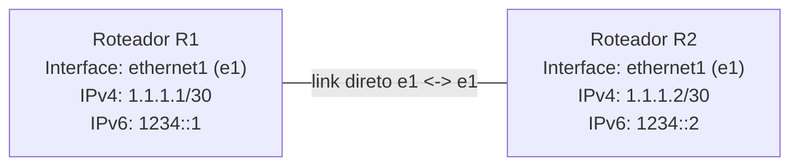

# Tutorial Básico do FreeRouter

O FreeRouter é um plano de controle: o processo do Sistema Operacional do Roteador fala diversos protocolos de rede, reencapsula pacotes e exporta tabelas de encaminhamento para switches de hardware. Basicamente, é necessário apenas instalar o Java Runtime Environment (JRE). Abaixo está demonstrado como instalá-lo nos sistemas operacionais: Linux, Windows e macOS.

---

## Instalação do Java

### Linux

Para fins de demonstração, foi escolhida a instalação no Linux baseado em Debian.

```bash
sudo apt install default-jre-headless --no-install-recommends
```

### Windows

Para instalar a versão Windows do Java, é necessário acessar o site oficial do Java e baixar o executável para Windows. Após o download, verifique se o seu usuário tem permissão de instalação e realize a instalação pelo ambiente gráfico.

### macOS

Existem várias opções para instalar o Java no macOS. Aqui escolhemos instalar em modo texto:

```bash
curl -s "https://get.sdkman.io" | bash
source "$HOME/.sdkman/bin/sdkman-init.sh"
sdk list java
sdk install java 17.0.2-open
sdk default java 17.0.2-open
java -version
```

---

## Instalação do FreeRtr

A página inicial do FreeRouter está em [freertr.org](http://freertr.org). A partir dessa página, você encontrará diversos recursos como código-fonte (existe também um espelho no GitHub), binários e outras imagens que podem ser de seu interesse. Basta baixar os arquivos `.jar` do FreeRouter:

```bash
wget freertr.org/rtr.jar
```

---

## Uso da VM no VirtualBox

Se você estiver em um laboratório Windows, pode usar a imagem de disco já preparada em [ubuntu.vdi].

Passos sugeridos:

1. Abra o VirtualBox.
2. Crie uma nova máquina virtual Linux Ubuntu 64-bit.
3. Quando chegar na parte do disco, escolha usar um disco existente.
4. Selecione o arquivo `basic/ubuntu.vdi`.
5. Inicie a VM.
6. Dentro da VM, abra este repositório e siga os exercícios normalmente a partir deste `readme.md`.

Se a VM não iniciar corretamente, confira se a máquina foi criada como `Ubuntu (64-bit)` e se há memória RAM suficiente disponível.

---

## Exercício 1: Topologia com 2 Roteadores

Diagrama visual da topologia usada neste exercício:



## Configuração dos Roteadores

### Hardware — Roteador 1

Arquivo de hardware do FreeRouter: `1/r1-hw.txt`

```
int eth1 eth 0000.1111.0001 127.0.0.1 26011 127.0.0.1 26021
tcp2vrf 1123 v1 23
```

### Software — Roteador 1

Arquivo de configuração de software do FreeRouter: `1/r1-sw.txt`

```
hostname r1
!
vrf definition v1
 exit
!
int eth1
 exit
!
server telnet tel
 security protocol telnet
 no exec authorization
 no login authentication
 vrf v1
 exit
!
```

### Hardware — Roteador 2

Arquivo de hardware do FreeRouter: `1/r2-hw.txt`

```
int eth1 eth 0000.2222.0001 127.0.0.1 26021 127.0.0.1 26011
tcp2vrf 2223 v1 23
```

### Software — Roteador 2

Arquivo de configuração de software do FreeRouter: `1/r2-sw.txt`

```
hostname r2
!
vrf definition v1
 exit
!
int eth1
vrf forwarding v1
exit
!
server telnet tel
 security protocol telnet
 no exec authorization
 no login authentication
 vrf v1
 exit
!
```

---

## Inicialização dos Roteadores R1 e R2

```bash
java -jar <caminho>/rtr.jar <parâmetros>
```

**Parâmetros disponíveis:**

| Parâmetro | Descrição |
|---|---|
| `router <cfg>` | Inicia o roteador em segundo plano |
| `routerc <cfg>` | Inicia o roteador com console |
| `routerw <cfg>` | Inicia o roteador com janela |
| `routercw <cfg>` | Inicia o roteador com console e janela |
| `routers <hwcfg> <swcfg>` | Inicia o roteador com configurações separadas |
| `routera <swcfg>` | Inicia o roteador com configuração de software |
| `test <cmd>` | Executa comando de teste |
| `show <cmd>` | Executa comando show |
| `exec <cmd>` | Executa comando exec |

**Inicialização do R1** com os arquivos `1/r1-hw.txt` e `1/r1-sw.txt` com prompt de console:

```bash
java -jar <caminho>rtr/rtr.jar routersc 1/r1-hw.txt 1/r1-sw.txt
```

**Inicialização do R2** com os arquivos `1/r2-hw.txt` e `1/r2-sw.txt` com prompt de console:

```bash
java -jar <caminho>/rtr.jar routersc 1/r2-hw.txt 1/r2-sw.txt
```

**Acesso via Telnet ao R1** (porta 1123):

```bash
telnet localhost 1123
```

**Acesso via Telnet ao R2** (porta 2223):

```bash
telnet localhost 2223
```

---

## Configuração de Endereçamento IP em Execução do R1 e R2

**Roteador R1:**

```
r1#?
r1#conf t
r1(cfg)#hostname r1
r1(cfg)#int ethernet1
r1(cfg-if)#vrf forwarding v1
r1(cfg-if)#ipv4 address 1.1.1.1 255.255.255.252
r1(cfg-if)#ipv6 address 1234::1 ffff:ffff:ffff:ffff::
r1(cfg-if)#desc r1@e1 -> r2@e1
r1(cfg-if)#no shut
r1(cfg-if)#end
r1#sh run
r1#sh int
```

**Roteador R2:**

```
r2#conf t
r2(cfg)#hostname r2
r2(cfg)#int ethernet1
r2(cfg-if)#vrf forwarding v1
r2(cfg-if)#ipv4 address 1.1.1.2 255.255.255.252
r2(cfg-if)#ipv6 address 1234::2 ffff:ffff:ffff:ffff::
r2(cfg-if)#desc r2@e1 -> r1@e1
r2(cfg-if)#no shut
r2(cfg-if)#end
r2#sh run
r2#sh int
```

---

## Teste de Conectividade entre R1 e R2

```
r1#ping 1.1.1.2 vrf v1
r2#ping 1.1.1.1 vrf v1
```

---

## Exercício 2: Rede Estática com 3 Roteadores

Implemente uma rede estática com 3 roteadores, utilizando seu número de matrícula e ano de matrícula para definir e atribuir seus próprios endereços IPv4 e IPv6.

**Exemplo:**

- Número de matrícula = 45
- Ano = 2026
- Endereço IPv4: `45.21.1.1 255.255.255.252`
- Endereço IPv6: `2026:45::1 ffff:ffff:ffff:ffff::`

### Comandos importantes de configuração

```bash
router(cfg)#ipv4 route v1 <rede destino> <máscara rede destino> <próximo salto>
router(cfg)#ipv4 route v1 0.0.0.0 0.0.0.0 1.1.1.2
router(cfg)#ipv6 route v1 <rede destino> <máscara rede destino> <próximo salto>
router(cfg)#ipv6 route v1 :: :: 1234::2
```

### Comandos importantes de troubleshooting

```bash
router#sh run
router#sh ipv4 route v1
router#sh ipv6 route v1
router#sh int
router#ping
router#traceroute
r1#ping 1.1.1.2 vrf v1
```

---

## Desafio 3: Topologia Full Mesh com RIP

Implemente uma topologia full mesh com o protocolo de roteamento dinâmico RIP, seguindo o padrão do exercício anterior.

**Exemplo:**

- Número de matrícula = 45
- Ano = 2021
- Endereço IPv4: `45.21.1.1 255.255.255.252`
- Endereço IPv6: `2021:45::1 ffff:ffff:ffff:ffff::`

### Comandos importantes de configuração

```bash
# Configuração RIP para IPv4
router(cfg)#router rip4 <id_processo>
router(cfg-rip)#vrf v1
router(cfg-rip)#redistributed connect

router(cfg)#int eth1
router(cfg-if)#router rip4 1 enable

# Configuração RIP para IPv6
router(cfg)#router rip6 <id_processo>
router(cfg-rip)#vrf v1
router(cfg-rip)#redistributed connect
router(cfg-rip)#net <rede>

router(cfg)#int eth1
router(cfg-if)#router rip6 1 enable
```

### Comandos importantes de troubleshooting

```bash
sh run
sh ipv4 route v1
sh ipv6 route v1
sh int
ping
traceroute
r1#ping 1.1.1.2 vrf v1
```

---

## Scripts de Automação com tmux

### Script para iniciar todos os roteadores

```bash
#!/bin/bash
# por Everson

# Variável de ambiente
RTR=<caminho do freerouter "rtr.jar">
HWSW=<caminho da pasta basic/1>

tmux new-session -d -s rare 'java -jar '$RTR' routersc '$HWSW'/r1-hw.txt '$HWSW'/r1-sw.txt'
tmux split-window -v -t 0 -p 50
tmux send 'java -jar '$RTR' routersc '$HWSW'/r2-hw.txt '$HWSW'/r2-sw.txt' ENTER;
tmux split-window -h -t 0 -p 50
tmux send 'java -jar '$RTR' routersc '$HWSW'/r3-hw.txt '$HWSW'/r3-sw.txt' ENTER;
tmux select-layout tiled;
tmux a;
```

### Script para parar todos os roteadores

```bash
#!/bin/bash
# por Everson

tmux kill-window -t rare
```

---

## Ferramentas

Baixar o pacote de ferramentas de rede do FreeRouter:

```bash
wget http://www.freertr.net/rtr-`uname -m`.tar -O rtr.tar
tar xvf rtr.tar .
```

---

## Material Extra

- [Vídeo tutorial 1](https://www.youtube.com/watch?v=yG6_HIRMXxE)
- [Vídeo tutorial 2](https://youtu.be/J308z6PA86M)
- [Arquivos de Roteamento — Protocolo ISIS (25/01/2023)](https://drive.google.com/file/d/1yWAqEZxyd31DtiI4ZZP2bqHcXuiBZtcg/view?usp=share_link)
- [Gravação da aula (25/01/2023)](https://drive.google.com/file/d/1XzQ6eQOPaGiJFfwVpxGaGHH96oGKFkqO/view?usp=sharing)

---

## Referências

- [http://www.freertr.net/](http://www.freertr.net/)
- [https://wiki.geant.org/](https://wiki.geant.org/)
