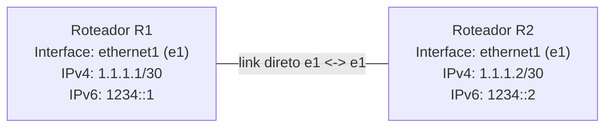
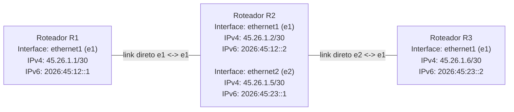
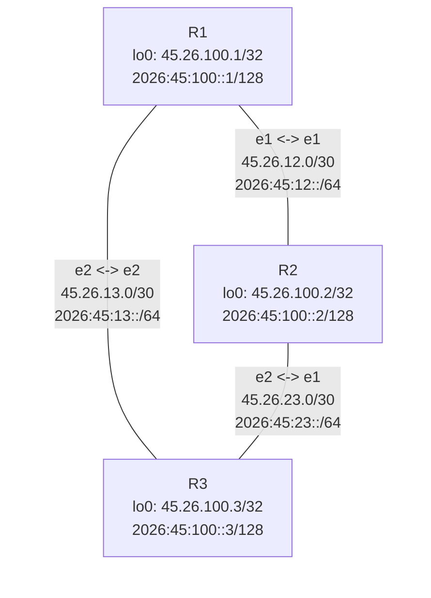

# Tutorial Básico do FreeRtR

O FreeRtR é um plano de controle: o processo do Sistema Operacional do Roteador fala diversos protocolos de rede, reencapsula pacotes e exporta tabelas de encaminhamento para switches de hardware. Basicamente, é necessário instalar o Java Runtime Environment (JRE), baixar o `rtr.jar` e executar os arquivos de hardware e software dos roteadores.

---

## Instalação do Java

### Linux

Para fins de demonstração, foi escolhida a instalação no Linux baseado em Debian/Ubuntu.

> O `rtr.jar` atual do FreeRtR exige Java 21. Se a VM tiver Java 11, a inicialização falhará com erro `UnsupportedClassVersionError`.

```bash
sudo apt update
sudo apt install openjdk-21-jre-headless tmux telnet --no-install-recommends
java -version
```

---

## Instalação do FreeRtr

A página inicial do FreeRtR está em [freertr.org](http://freertr.org). A partir dessa página, você encontrará diversos recursos como código-fonte (existe também um espelho no GitHub), binários e outras imagens que podem ser de seu interesse.

Neste repositório, o caminho usado nos exemplos é `rtr/rtr.jar` a partir da raiz do projeto. A pasta `rtr/` é local e pode ficar fora do controle de versão.

```bash
mkdir -p rtr
curl -L http://freertr.org/rtr.jar -o rtr/rtr.jar
```

---


## Exercício 1: Topologia com 2 Roteadores

Diagrama visual da topologia usada neste exercício:



## Configuração dos Roteadores

### Hardware — Roteador 1

Arquivo de hardware do FreeRtR: `1/r1-hw.txt`

```
int eth1 eth 0000.1111.0001 127.0.0.1 26011 127.0.0.1 26021
tcp2vrf 1123 v1 23
```

### Software — Roteador 1

Arquivo de configuração de software do FreeRtR: `1/r1-sw.txt`

```
hostname r1
!
vrf definition v1
 exit
!
int eth1
 exit
!
server telnet tel
 security protocol telnet
 no exec authorization
 no login authentication
 vrf v1
 exit
!
```

### Hardware — Roteador 2

Arquivo de hardware do FreeRtR: `1/r2-hw.txt`

```
int eth1 eth 0000.2222.0001 127.0.0.1 26021 127.0.0.1 26011
tcp2vrf 2223 v1 23
```

### Software — Roteador 2

Arquivo de configuração de software do FreeRtR: `1/r2-sw.txt`

```
hostname r2
!
vrf definition v1
 exit
!
int eth1
vrf forwarding v1
exit
!
server telnet tel
 security protocol telnet
 no exec authorization
 no login authentication
 vrf v1
 exit
!
```

---

## Inicialização dos Roteadores R1 e R2

```bash
java -jar <caminho>/rtr.jar <parâmetros>
```

**Inicialização do R1** com os arquivos `1/r1-hw.txt` e `1/r1-sw.txt` com prompt de console:

```bash
java -jar <caminho>/rtr.jar routersc 1/r1-hw.txt 1/r1-sw.txt
```

**Inicialização do R2** com os arquivos `1/r2-hw.txt` e `1/r2-sw.txt` com prompt de console:

```bash
java -jar <caminho>/rtr.jar routersc 1/r2-hw.txt 1/r2-sw.txt
```

**Acesso via Telnet ao R1** (porta 1123):

```bash
telnet localhost 1123
```

**Acesso via Telnet ao R2** (porta 2223):

```bash
telnet localhost 2223
```

---

## Configuração de Endereçamento IP em Execução do R1 e R2

**Roteador R1:**

```
r1#?
r1#conf t
r1(cfg)#hostname r1
r1(cfg)#int ethernet1
r1(cfg-if)#vrf forwarding v1
r1(cfg-if)#ipv4 address 1.1.1.1 255.255.255.252
r1(cfg-if)#ipv6 address 1234::1 ffff:ffff:ffff:ffff::
r1(cfg-if)#desc r1@e1 -> r2@e1
r1(cfg-if)#no shut
r1(cfg-if)#end
r1#sh run
r1#sh int
```

**Roteador R2:**

```
r2#conf t
r2(cfg)#hostname r2
r2(cfg)#int ethernet1
r2(cfg-if)#vrf forwarding v1
r2(cfg-if)#ipv4 address 1.1.1.2 255.255.255.252
r2(cfg-if)#ipv6 address 1234::2 ffff:ffff:ffff:ffff::
r2(cfg-if)#desc r2@e1 -> r1@e1
r2(cfg-if)#no shut
r2(cfg-if)#end
r2#sh run
r2#sh int
```

---

## Teste de Conectividade entre R1 e R2

```
r1#ping 1.1.1.2 vrf v1
r2#ping 1.1.1.1 vrf v1
```

---

## Exercício 2: Rede Estática com 3 Roteadores

Implemente uma rede estática com 3 roteadores, utilizando seu número de matrícula e ano de matrícula para definir e atribuir seus próprios endereços IPv4 e IPv6.

Neste exercício, a topologia possui dois enlaces ponto a ponto:

- R1 conectado ao R2
- R2 conectado ao R3

O R2 funciona como roteador intermediário entre as duas redes. Por isso, R1 e R3 precisam de rotas estáticas para alcançar a rede que está do outro lado do R2.

Diagrama visual da topologia usada neste exercício:



**Exemplo:**

- Número de matrícula = 45
- Ano = 2026
- Endereço IPv4: `45.26.1.1 255.255.255.252`
- Endereço IPv6: `2026:45::1 ffff:ffff:ffff:ffff::`

> Observação: neste exemplo, o IPv4 usa `45` como primeiro octeto por causa da matrícula e `26` como segundo octeto por causa dos dois últimos dígitos do ano. Se sua matrícula ou ano forem diferentes, substitua esses valores mantendo a mesma lógica.

Nos endereços IPv6, `2026:45` identifica o ano e a matrícula. Os blocos `12` e `23` foram usados apenas para separar visualmente os enlaces R1-R2 e R2-R3.

## Plano de Endereçamento

| Enlace | Roteador | Interface | IPv4 | Máscara IPv4 | IPv6 | Máscara IPv6 |
| --- | --- | --- | --- | --- | --- | --- |
| R1-R2 | R1 | ethernet1 | `45.26.1.1` | `255.255.255.252` | `2026:45:12::1` | `ffff:ffff:ffff:ffff::` |
| R1-R2 | R2 | ethernet1 | `45.26.1.2` | `255.255.255.252` | `2026:45:12::2` | `ffff:ffff:ffff:ffff::` |
| R2-R3 | R2 | ethernet2 | `45.26.1.5` | `255.255.255.252` | `2026:45:23::1` | `ffff:ffff:ffff:ffff::` |
| R2-R3 | R3 | ethernet1 | `45.26.1.6` | `255.255.255.252` | `2026:45:23::2` | `ffff:ffff:ffff:ffff::` |

Redes usadas:

| Enlace | Rede IPv4 | Rede IPv6 |
| --- | --- | --- |
| R1-R2 | `45.26.1.0/30` | `2026:45:12::/64` |
| R2-R3 | `45.26.1.4/30` | `2026:45:23::/64` |

## Configuração dos Roteadores

### Hardware — Roteador 1

Arquivo de hardware do FreeRtR: `2/r1-hw.txt`

```
int eth1 eth 0000.1111.0001 127.0.0.1 26011 127.0.0.1 26021
tcp2vrf 1123 v1 23
```

### Software — Roteador 1

Arquivo de configuração de software do FreeRtR: `2/r1-sw.txt`

```
hostname r1
!
vrf definition v1
 exit
!
int eth1
 vrf forwarding v1
 ipv4 address 45.26.1.1 255.255.255.252
 ipv6 address 2026:45:12::1 ffff:ffff:ffff:ffff::
 desc r1@e1 -> r2@e1
 no shutdown
 exit
!
ipv4 route v1 45.26.1.4 255.255.255.252 45.26.1.2
ipv6 route v1 2026:45:23:: ffff:ffff:ffff:ffff:: 2026:45:12::2
!
server telnet tel
 security protocol telnet
 no exec authorization
 no login authentication
 vrf v1
 exit
!
```

### Hardware — Roteador 2

Arquivo de hardware do FreeRtR: `2/r2-hw.txt`

```
int eth1 eth 0000.2222.0001 127.0.0.1 26021 127.0.0.1 26011
int eth2 eth 0000.2222.0002 127.0.0.1 26022 127.0.0.1 26031
tcp2vrf 2223 v1 23
```

### Software — Roteador 2

Arquivo de configuração de software do FreeRtR: `2/r2-sw.txt`

```
hostname r2
!
vrf definition v1
 exit
!
int eth1
 vrf forwarding v1
 ipv4 address 45.26.1.2 255.255.255.252
 ipv6 address 2026:45:12::2 ffff:ffff:ffff:ffff::
 desc r2@e1 -> r1@e1
 no shutdown
 exit
!
int eth2
 vrf forwarding v1
 ipv4 address 45.26.1.5 255.255.255.252
 ipv6 address 2026:45:23::1 ffff:ffff:ffff:ffff::
 desc r2@e2 -> r3@e1
 no shutdown
 exit
!
server telnet tel
 security protocol telnet
 no exec authorization
 no login authentication
 vrf v1
 exit
!
```

### Hardware — Roteador 3

Arquivo de hardware do FreeRtR: `2/r3-hw.txt`

```
int eth1 eth 0000.3333.0001 127.0.0.1 26031 127.0.0.1 26022
tcp2vrf 3323 v1 23
```

### Software — Roteador 3

Arquivo de configuração de software do FreeRtR: `2/r3-sw.txt`

```
hostname r3
!
vrf definition v1
 exit
!
int eth1
 vrf forwarding v1
 ipv4 address 45.26.1.6 255.255.255.252
 ipv6 address 2026:45:23::2 ffff:ffff:ffff:ffff::
 desc r3@e1 -> r2@e2
 no shutdown
 exit
!
ipv4 route v1 45.26.1.0 255.255.255.252 45.26.1.5
ipv6 route v1 2026:45:12:: ffff:ffff:ffff:ffff:: 2026:45:23::1
!
server telnet tel
 security protocol telnet
 no exec authorization
 no login authentication
 vrf v1
 exit
!
```

---

## Inicialização dos Roteadores R1, R2 e R3

O exercício 2 já possui um script para iniciar os três roteadores em uma sessão `tmux`:

```bash
cd basic/2
./script.sh
```

O script procura automaticamente o `rtr.jar` em `../../rtr.jar` ou `../../rtr/rtr.jar`. Se o arquivo estiver em outro caminho, informe a variável `RTR`:

```bash
cd basic/2
RTR=/caminho/rtr.jar ./script.sh
```

Por padrão, a sessão `tmux` se chama `rare`. Para sair do `tmux` sem parar os roteadores, use `Ctrl+b` e depois `d`. Para voltar à sessão:

```bash
tmux attach -t rare
```

Para parar o laboratório:

```bash
tmux kill-session -t rare
```

Também é possível iniciar cada roteador manualmente em terminais separados:

```bash
java -jar <caminho>/rtr.jar <parâmetros>
```

**Inicialização do R1** com os arquivos `2/r1-hw.txt` e `2/r1-sw.txt` com prompt de console:

```bash
java -jar <caminho>/rtr.jar routersc 2/r1-hw.txt 2/r1-sw.txt
```

**Inicialização do R2** com os arquivos `2/r2-hw.txt` e `2/r2-sw.txt` com prompt de console:

```bash
java -jar <caminho>/rtr.jar routersc 2/r2-hw.txt 2/r2-sw.txt
```

**Inicialização do R3** com os arquivos `2/r3-hw.txt` e `2/r3-sw.txt` com prompt de console:

```bash
java -jar <caminho>/rtr.jar routersc 2/r3-hw.txt 2/r3-sw.txt
```

**Acesso via Telnet ao R1** (porta 1123):

```bash
telnet localhost 1123
```

**Acesso via Telnet ao R2** (porta 2223):

```bash
telnet localhost 2223
```

**Acesso via Telnet ao R3** (porta 3323):

```bash
telnet localhost 3323
```

---

## Configuração de Endereçamento IP em Execução do R1, R2 e R3

As configurações abaixo já foram persistidas nos arquivos `2/r1-sw.txt`, `2/r2-sw.txt` e `2/r3-sw.txt`. Elas também podem ser digitadas manualmente no console dos roteadores para fins de prática.

**Roteador R1:**

```
r1#conf t
r1(cfg)#hostname r1
r1(cfg)#int ethernet1
r1(cfg-if)#vrf forwarding v1
r1(cfg-if)#ipv4 address 45.26.1.1 255.255.255.252
r1(cfg-if)#ipv6 address 2026:45:12::1 ffff:ffff:ffff:ffff::
r1(cfg-if)#desc r1@e1 -> r2@e1
r1(cfg-if)#no shut
r1(cfg-if)#exit
r1(cfg)#ipv4 route v1 45.26.1.4 255.255.255.252 45.26.1.2
r1(cfg)#ipv6 route v1 2026:45:23:: ffff:ffff:ffff:ffff:: 2026:45:12::2
r1(cfg)#end
r1#sh run
r1#sh int
```

**Roteador R2:**

```
r2#conf t
r2(cfg)#hostname r2
r2(cfg)#int ethernet1
r2(cfg-if)#vrf forwarding v1
r2(cfg-if)#ipv4 address 45.26.1.2 255.255.255.252
r2(cfg-if)#ipv6 address 2026:45:12::2 ffff:ffff:ffff:ffff::
r2(cfg-if)#desc r2@e1 -> r1@e1
r2(cfg-if)#no shut
r2(cfg-if)#exit
r2(cfg)#int ethernet2
r2(cfg-if)#vrf forwarding v1
r2(cfg-if)#ipv4 address 45.26.1.5 255.255.255.252
r2(cfg-if)#ipv6 address 2026:45:23::1 ffff:ffff:ffff:ffff::
r2(cfg-if)#desc r2@e2 -> r3@e1
r2(cfg-if)#no shut
r2(cfg-if)#end
r2#sh run
r2#sh int
```

**Roteador R3:**

```
r3#conf t
r3(cfg)#hostname r3
r3(cfg)#int ethernet1
r3(cfg-if)#vrf forwarding v1
r3(cfg-if)#ipv4 address 45.26.1.6 255.255.255.252
r3(cfg-if)#ipv6 address 2026:45:23::2 ffff:ffff:ffff:ffff::
r3(cfg-if)#desc r3@e1 -> r2@e2
r3(cfg-if)#no shut
r3(cfg-if)#exit
r3(cfg)#ipv4 route v1 45.26.1.0 255.255.255.252 45.26.1.5
r3(cfg)#ipv6 route v1 2026:45:12:: ffff:ffff:ffff:ffff:: 2026:45:23::1
r3(cfg)#end
r3#sh run
r3#sh int
```

---

## Explicação das Rotas Estáticas

O R1 conhece diretamente apenas a rede do enlace R1-R2:

- IPv4: `45.26.1.0/30`
- IPv6: `2026:45:12::/64`

Para chegar até a rede R2-R3, o R1 precisa enviar os pacotes para o próximo salto R2:

```bash
r1(cfg)#ipv4 route v1 45.26.1.4 255.255.255.252 45.26.1.2
r1(cfg)#ipv6 route v1 2026:45:23:: ffff:ffff:ffff:ffff:: 2026:45:12::2
```

O R3 conhece diretamente apenas a rede do enlace R2-R3:

- IPv4: `45.26.1.4/30`
- IPv6: `2026:45:23::/64`

Para chegar até a rede R1-R2, o R3 precisa enviar os pacotes para o próximo salto R2:

```bash
r3(cfg)#ipv4 route v1 45.26.1.0 255.255.255.252 45.26.1.5
r3(cfg)#ipv6 route v1 2026:45:12:: ffff:ffff:ffff:ffff:: 2026:45:23::1
```

O R2 não precisa de rotas estáticas neste exemplo, porque ele está diretamente conectado às duas redes.

---

## Teste de Conectividade entre os 3 Roteadores

Este laboratório foi validado com os arquivos `2/r1-sw.txt`, `2/r2-sw.txt` e `2/r3-sw.txt` completos. Após a primeira tentativa, pode haver perda inicial de pacotes enquanto ARP/ND aprende os vizinhos; ao repetir os testes, os pings devem responder com sucesso.

Primeiro, teste os enlaces diretamente conectados:

```
r1#ping 45.26.1.2 vrf v1
r2#ping 45.26.1.1 vrf v1
r2#ping 45.26.1.6 vrf v1
r3#ping 45.26.1.5 vrf v1
```

Depois, teste a comunicação de ponta a ponta entre R1 e R3:

```
r1#ping 45.26.1.6 vrf v1
r3#ping 45.26.1.1 vrf v1
r1#ping 2026:45:23::2 vrf v1
r3#ping 2026:45:12::1 vrf v1
```

Use `traceroute` para confirmar que o caminho passa pelo R2:

```
r1#traceroute 45.26.1.6 vrf v1
r3#traceroute 45.26.1.1 vrf v1
```

---

## Comandos Importantes de Configuração

```bash
router(cfg)#ipv4 route v1 <rede destino> <máscara rede destino> <próximo salto>
router(cfg)#ipv4 route v1 45.26.1.4 255.255.255.252 45.26.1.2
router(cfg)#ipv6 route v1 <rede destino> <máscara rede destino> <próximo salto>
router(cfg)#ipv6 route v1 2026:45:23:: ffff:ffff:ffff:ffff:: 2026:45:12::2
```

## Comandos Importantes de Troubleshooting

```bash
router#sh run
router#sh ipv4 route v1
router#sh ipv6 route v1
router#sh int
router#ping
router#traceroute
r1#ping 45.26.1.6 vrf v1
r3#ping 45.26.1.1 vrf v1
```

---

## Scripts de Automação com tmux

O exercício 2 possui o arquivo `2/script.sh`. Ele inicia R1, R2 e R3 em uma única janela `tmux`, dividida em três painéis.

```bash
#!/bin/bash
# por Everson

# Variáveis de ambiente.
# Altere RTR se o rtr.jar estiver em outro caminho.
if [ -z "$RTR" ]; then
  if [ -f "../../rtr.jar" ]; then
    RTR="../../rtr.jar"
  else
    RTR="../../rtr/rtr.jar"
  fi
fi
HWSW=${HWSW:-.}
SESSION=${SESSION:-rare}

if [ ! -f "$RTR" ]; then
  echo "Arquivo rtr.jar não encontrado: $RTR"
  echo "Use, por exemplo: RTR=/caminho/rtr.jar ./script.sh"
  exit 1
fi

if ! command -v tmux >/dev/null 2>&1; then
  echo "tmux não encontrado. Instale com: sudo apt install tmux"
  exit 1
fi

tmux kill-session -t "$SESSION" 2>/dev/null
sleep 1

tmux new-session -d -s "$SESSION" "java -jar $RTR routersc $HWSW/r1-hw.txt $HWSW/r1-sw.txt"
tmux split-window -v -t "$SESSION":0 -p 50
tmux send-keys -t "$SESSION":0 "java -jar $RTR routersc $HWSW/r2-hw.txt $HWSW/r2-sw.txt" ENTER
tmux split-window -h -t "$SESSION":0.0 -p 50
tmux send-keys -t "$SESSION":0 "java -jar $RTR routersc $HWSW/r3-hw.txt $HWSW/r3-sw.txt" ENTER
tmux select-layout -t "$SESSION" tiled
tmux attach -t "$SESSION"
```

Para usar:

```bash
cd basic/2
./script.sh
```

Para parar:

```bash
tmux kill-session -t rare
```

---

## Desafio 3: Topologia Full Mesh com RIP

O diretório `3/` contém uma topologia full mesh com 3 roteadores usando RIP para IPv4 e IPv6. A ideia é observar, de forma didática, a diferença entre redes diretamente conectadas e redes aprendidas dinamicamente.

Diagrama visual da topologia usada neste desafio:



Objetivos:

- montar uma topologia full mesh com R1, R2 e R3;
- configurar endereços IPv4 e IPv6 nos enlaces;
- criar uma loopback em cada roteador para representar uma rede própria;
- ativar RIP4 e RIP6 nas interfaces;
- validar as rotas aprendidas com `show route`, `ping` e `traceroute`.

Arquivos do desafio:

- `3/r1-hw.txt`, `3/r2-hw.txt`, `3/r3-hw.txt`: arquivos de hardware;
- `3/r1-sw.txt`, `3/r2-sw.txt`, `3/r3-sw.txt`: configurações com RIP4 e RIP6;
- `3/script.sh`: inicia a topologia no `tmux`;
- `3/stop.sh`: para a sessão do laboratório.

### Plano de Endereçamento

| Enlace | Roteador | Interface | IPv4 | IPv6 |
| --- | --- | --- | --- | --- |
| R1-R2 | R1 | ethernet1 | `45.26.12.1/30` | `2026:45:12::1/64` |
| R1-R2 | R2 | ethernet1 | `45.26.12.2/30` | `2026:45:12::2/64` |
| R2-R3 | R2 | ethernet2 | `45.26.23.1/30` | `2026:45:23::1/64` |
| R2-R3 | R3 | ethernet1 | `45.26.23.2/30` | `2026:45:23::2/64` |
| R1-R3 | R1 | ethernet2 | `45.26.13.1/30` | `2026:45:13::1/64` |
| R1-R3 | R3 | ethernet2 | `45.26.13.2/30` | `2026:45:13::2/64` |

| Roteador | Loopback IPv4 | Loopback IPv6 |
| --- | --- | --- |
| R1 | `45.26.100.1/32` | `2026:45:100::1/128` |
| R2 | `45.26.100.2/32` | `2026:45:100::2/128` |
| R3 | `45.26.100.3/32` | `2026:45:100::3/128` |

### Como Executar

Na raiz do repositório, confirme que o `rtr.jar` existe:

```bash
ls rtr/rtr.jar
```

Entre no diretório do laboratório e inicie a topologia:

```bash
cd basic/3
./script.sh
```

Para sair do `tmux` sem parar os roteadores, use `Ctrl+b` e depois `d`.

Para voltar:

```bash
tmux attach -t rip-fullmesh
```

Para parar:

```bash
cd basic/3
./stop.sh
```

### Acesso por Telnet

Em outro terminal:

```bash
telnet localhost 3123
telnet localhost 3223
telnet localhost 3423
```

### Comandos Importantes de Configuração

```bash
# Configuração RIP para IPv4
router(cfg)#router rip4 <id_processo>
router(cfg-rip)#vrf v1
router(cfg-rip)#redistribute connected

router(cfg)#int eth1
router(cfg-if)#router rip4 1 enable

# Configuração RIP para IPv6
router(cfg)#router rip6 <id_processo>
router(cfg-rip)#vrf v1
router(cfg-rip)#redistribute connected

router(cfg)#int eth1
router(cfg-if)#router rip6 1 enable
```

### O Que Observar

Comece pelas interfaces e pela tabela de rotas:

```text
router#show interfaces
router#show ipv4 route v1
router#show ipv6 route v1
```

Em cada roteador, separe mentalmente:

- rotas conectadas: redes das interfaces locais;
- rotas aprendidas: redes recebidas dos vizinhos via RIP;
- loopbacks: bons alvos para testar roteamento fim a fim.

### Testes Sugeridos

Do R1 para as loopbacks remotas:

```text
r1#ping 45.26.100.2 vrf v1
r1#ping 45.26.100.3 vrf v1
r1#ping 2026:45:100::2 vrf v1
r1#ping 2026:45:100::3 vrf v1
```

Do R2:

```text
r2#ping 45.26.100.1 vrf v1
r2#ping 45.26.100.3 vrf v1
r2#ping 2026:45:100::1 vrf v1
r2#ping 2026:45:100::3 vrf v1
```

Do R3:

```text
r3#ping 45.26.100.1 vrf v1
r3#ping 45.26.100.2 vrf v1
r3#ping 2026:45:100::1 vrf v1
r3#ping 2026:45:100::2 vrf v1
```

Use `traceroute` para ver o caminho escolhido:

```text
r1#traceroute 45.26.100.2 vrf v1
r1#traceroute 45.26.100.3 vrf v1
r2#traceroute 45.26.100.1 vrf v1
```

### Experimentos de Aprendizado

Veja as rotas antes de testar ping:

```text
r1#show ipv4 route v1
r1#show ipv6 route v1
```

Desative um enlace e observe a convergência:

```text
r1#conf t
r1(cfg)#interface ethernet2
r1(cfg-if)#shutdown
r1(cfg-if)#end
```

Depois, confira se o tráfego ainda chega ao R3 passando por R2:

```text
r1#ping 45.26.100.3 vrf v1
r1#traceroute 45.26.100.3 vrf v1
```

Reative o enlace:

```text
r1#conf t
r1(cfg)#interface ethernet2
r1(cfg-if)#no shutdown
r1(cfg-if)#end
```

### Ideia Principal

Em uma rede full mesh, cada roteador tem dois vizinhos diretos. Mesmo assim, ele não conhece automaticamente as loopbacks dos outros roteadores. O RIP faz esse anúncio dinamicamente, permitindo que cada roteador aprenda as redes que não estão diretamente conectadas a ele.


## Ferramentas

Baixar o pacote de ferramentas de rede do FreeRtR:

```bash
wget http://www.freertr.net/rtr-`uname -m`.tar -O rtr.tar
tar xvf rtr.tar .
```

---

## Material Extra

- [Vídeo tutorial 1](https://www.youtube.com/watch?v=yG6_HIRMXxE)
- [Vídeo tutorial 2](https://youtu.be/J308z6PA86M)
- [Arquivos de Roteamento — Protocolo ISIS (25/01/2023)](https://drive.google.com/file/d/1yWAqEZxyd31DtiI4ZZP2bqHcXuiBZtcg/view?usp=share_link)
- [Gravação da aula (25/01/2023)](https://drive.google.com/file/d/1XzQ6eQOPaGiJFfwVpxGaGHH96oGKFkqO/view?usp=sharing)

---

## Referências

- [http://www.freertr.net/](http://www.freertr.net/)
- [https://wiki.geant.org/](https://wiki.geant.org/)
